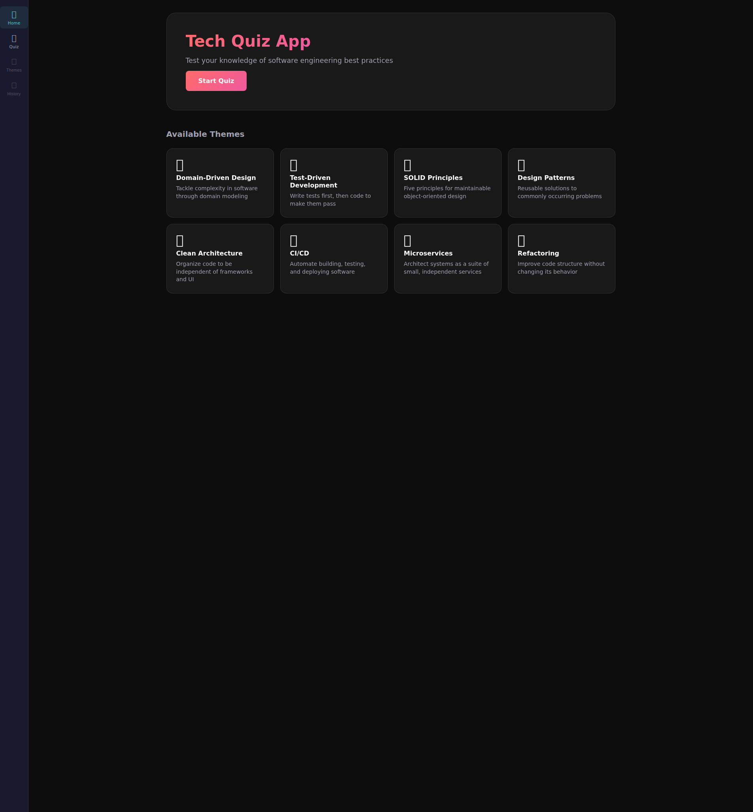

# Tech Quizz

A modern, interactive web application for software engineers to test and expand their technical knowledge through themed quizzes.



## 🚀 Features

- **Themed Quizzes**: Choose from a variety of software engineering topics:
  - Domain-Driven Design (DDD)
  - Test-Driven Development (TDD)
  - SOLID Principles
  - Design Patterns
  - Clean Architecture
  - CI/CD
  - Microservices
  - Refactoring
- **Difficulty Levels**: Select between Beginner, Intermediate, and Advanced questions.
- **Instant Feedback**: Get immediate results after each question with detailed explanations and "Did you know?" bonus facts.
- **Code Snippets**: Practice reading and analyzing real-world code examples with syntax highlighting.
- **Progress Tracking**: Visual progress bar and a comprehensive results summary at the end of each quiz.
- **Responsive Design**: Fully optimized for both desktop and mobile devices.

## 🛠️ Tech Stack

- **Frontend**: [Vue 3](https://vuejs.org/) (Composition API, `<script setup>`)
- **Language**: [TypeScript](https://www.typescriptlang.org/)
- **Routing**: [Vue Router](https://router.vuejs.org/)
- **Build Tool**: [Vite](https://vitejs.dev/)
- **Styling**: Modern CSS with a focus on responsiveness and accessibility.
- **Code Highlighting**: [Prism.js](https://prismjs.com/)
- **Testing**: [Vitest](https://vitest.dev/) for unit/component tests and [Playwright](https://playwright.dev/) for E2E testing.

## 📂 Project Structure

```text
frontend/
├── src/
│   ├── components/       # Reusable UI components (Quiz, Layout, Results)
│   ├── composables/      # Shared logic and state management
│   ├── data/             # Static question bank (JSON format)
│   ├── router/           # Navigation configuration
│   ├── types/            # TypeScript interfaces and types
│   ├── views/            # Main page components
│   └── App.vue           # Root component
├── e2e/                  # Playwright end-to-end tests
└── tests/                # Vitest unit and component tests
```

## 🚥 Getting Started

### Prerequisites

- Node.js (v18+)
- npm

### Installation

1. Clone the repository:
   ```bash
   git clone <repository-url>
   cd tech-quizz
2. Install dependencies:
   ```bash
   cd frontend
   npm install
   ```
3. Start the development server:
   ```bash
   npm run dev
   ```
4. Build for production:
   ```bash
   npm run build
   ```

## 🧪 Testing

### Unit and Component Tests (Vitest)
```bash
npm test
```

### End-to-End Tests (Playwright)
```bash
# Run tests
npm run test:e2e

# Run tests in UI mode
npm run test:e2e:ui
```

### Linting and Formatting
```bash
# Run linter
npm run lint

# Fix linting issues
npm run lint:fix

# Check formatting
npm run format:check
```

## 📝 License

This project is licensed under the MIT License - see the LICENSE file for details.
